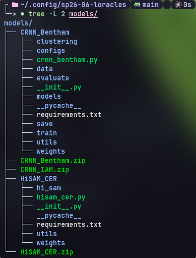
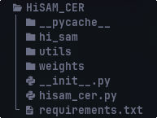
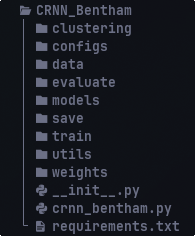

# LTU HTR

[](https://github.com/Keys-481/sp26-06-loracles/actions/workflows/node.js.yaml)
[](https://github.com/Keys-481/sp26-06-loracles/actions/workflows/lint.yaml)

## Instructions
### Running the Application

1. Clone the repo `git clone https://github.com/Keys-481/sp26-06-loracles.git`
2. Download model wrappers from https://drive.google.com/drive/folders/1EL8MafnuoAKZwWYA-GQE8o-8HQ1v22yV?usp=drive_link 
3. Extract the wrappers to:
    - %APPDATA%/sp26-06-loracles/models/ for Windows
    - ~/Library/Application Support/sp26-06-loracles/models/ for macOS
    - ~/.config/sp26-06-loracles/models/ for Linux

    When installed, the folder hierarchy should look similar to this:  
    

4. From the project root, run `npm install`.
5. Running `npm run start` will launch the application.


### Packaging and Installing the Application
1. Run `npm run make`.  
2. This will produce a setup/install file under `out/` that can be distributed for the given system architecture.
3. Running this file will install the app to your system.
4. Model wrappers will need to be imported to local app data as in step 3 of “Running the Application”.

**Note**: Packaging is not properly configured for Linux systems.

### Model Interface

Included with the Python source code is an interface for adding additional model wrappers or modules, allowing for use 
with new checkpoints and model architectures over time. This interface can be found in 
`src/inference/interface/base_models.py`, and defines two separate abstract model classes for implementing model 
wrappers:
- LineSegmentationModel
- HTRModel

Various utility classes are also available in src/inference/interface/utils.py for handling model outputs.

Model wrappers are defined as a folder containing:
- A Python file implementing one of the abstract interface classes
    - This file’s name should shadow the parent folder name to be detected by the Python server
    - This file should exist at the root of the folder
- A requirements.txt file defining the necessary dependencies for the implemented model
    - This should exist at the root of the folder
    - Any auxiliary files needed for the model being wrapped

A template for model wrappers can be found in `docs/examples/`.

Below are example implementations of HiSAM as a LineSegmentationModel and CRNN as an HTRModel.

#### LineSegmentationModel
LineSegmentationModel is for models that segment images along text barriers. Output is of the form 
LineSegmentationOuput, pairing polygon points representing image masks with the source image path.

Example wrapper hierarchy:  


Example implementation hisam_cer.py:
```python
import cv2
import numpy as np
import pathlib
import torch
import random
from typing import Dict, List
from src.inference.interface import LineSegmentationModel, LineSegmentationOutput, Polygon, PolygonPoint
from .utils import load_manifest
from .hi_sam.modeling.build import model_registry
from .hi_sam.modeling.auto_mask_generator import AutoMaskGenerator

SEGMENTER_MANIFEST = f"{pathlib.Path(__file__).parent.resolve()}/utils/segmenter.json"


class HiSAM(LineSegmentationModel):
    def __init__(self):
        self.m = load_manifest(SEGMENTER_MANIFEST)
        manifest_dir = pathlib.Path(SEGMENTER_MANIFEST).parent
        self.m.config.checkpoint = str((manifest_dir / self.m.config.checkpoint).resolve())
        self.m.config.pretrained_path = str((manifest_dir / self.m.config.pretrained_path).resolve())
        print("#############################")
        print("Seed:", self.m.config.seed)
        if self.m.arch == "hisam":
        torch.manual_seed(self.m.config.seed)
        np.random.seed(self.m.config.seed)
        random.seed(self.m.config.seed)
        torch.cuda.manual_seed(self.m.config.seed)
        torch.cuda.manual_seed_all(self.m.config.seed)
        hisam = model_registry[self.m.config.model_type](self.m.config)
        hisam.eval()
        hisam.to(self.device)
        self.segmenter = AutoMaskGenerator(hisam)

    @property
    def name(self) -> str:
        return "Hi-SAM"

    @property
    def description(self) -> str:
        return "Hi-SAM"

    @property
    def user_options(self) -> Dict[str, int | float | str] | None:
        return {}

    @property
    def advanced_user_options(self) -> Dict[str, int | float | str] | None:
        return None

    def __call__(self, image_paths: List[str]) -> List[LineSegmentationOutput]:
        outputs = []

        for pth in image_paths:
            img = cv2.imread(pth)
            img = cv2.cvtColor(img, cv2.COLOR_BGR2RGB)

            self.segmenter.set_image(img)

            masks, scores = self.segmenter.predict_text_detection(
                from_low_res=False,
                fg_points_num=self.m.config.fg_points_num,
                batch_points_num=min(self.m.config.fg_points_num, 100),
                score_thresh=self.m.config.nms[0],
                nms_thresh=self.m.config.nms[1],
                zero_shot=self.m.config.zero_shot,
                dataset=self.m.config.dataset
            )

            polygons = []
            if masks is not None:
                for mask in masks:
                    mask = np.squeeze(mask)

                    binary_mask = (mask > 0).astype(np.uint8)  # 0/1
                    binary_mask = binary_mask * 255  # convert to 0/255 for OpenCV
                    num_labels, labels, stats, centroids = cv2.connectedComponentsWithStats(binary_mask, connectivity=8)

                    if num_labels <= 1: continue

                    areas = stats[1:, 4]  # skip background (index 0) # stats[:, 4] is the area of each component
                    max_area = areas.max()
                    threshold = 0.05 * max_area  # 5% of largest area

                    # Create new mask with only large components
                    filtered_mask = np.zeros_like(binary_mask)

                    for i, area in enumerate(areas):
                        if area >= threshold:
                            filtered_mask[labels == i + 1] = 255  # i+1 because stats skips background

                    filtered_mask = (filtered_mask > 0).astype(np.uint8)

                    ys, xs = np.where(filtered_mask)
                    if len(xs) == 0 or len(ys) == 0: continue

                    xmin, ymin = int(np.min(xs)), int(np.min(ys))
                    xmax, ymax = int(np.max(xs)), int(np.max(ys))
                    polygons.append(Polygon([
                        PolygonPoint(xmin, ymin),
                        PolygonPoint(xmax, ymin),
                        PolygonPoint(xmax, ymax),
                        PolygonPoint(xmin, ymax)
                    ]))
            outputs.append(LineSegmentationOutput(polygons=polygons, image_path=pth))
        return outputs
```

#### HTRModel
HTRModel is for models that detect text from image masks as LineSegmentationOutput. The output is in the form of 
TextRecognitionOutput, pairing each detected text line with its corresponding polygon and source image path.

Example wrapper hierarchy:  


Example implementation crnn_bentham.py:
```python
import math
import pathlib
from typing import List, Dict

import cv2
import numpy as np
import torch

from src.inference.interface import LineSegmentationOutput
from .data.globalvalue.text_comon_values import BLANK_STR_TOKEN
from .data.image.preprocess_img import preprocess_img_line
from .data.text.charset_token import CharsetToken
from .data.text.best_path import ctc_best_path_one
from .models.crnn.crnn import CRNN
from .models.utils.load_model import load_pretrained_model
from .utils.manifest import load_manifest
from src.inference.interface.base_models import HTRModel
from src.inference.interface.utils import TextRecognitionOutput, TextAnnotation

HTR_MANIFEST = f"{pathlib.Path(__file__).parent.resolve()}/utils/htr.json"


class ConvRecNN(HTRModel):

    @property
    def name(self) -> str:
        return "ConvRecNN"

    @property
    def description(self) -> str:
        return "HTR via Convolutional Recurrent Neural Network"

    @property
    def user_options(self) -> Dict[str, int | float | str] | None:
        return None

    @property
    def advanced_user_options(self) -> Dict[str, int | float | str] | None:
        return None

    def __init__(self):
        self.m = load_manifest(HTR_MANIFEST)
        manifest_dir = pathlib.Path(HTR_MANIFEST).parent
        self.m.config.pretrained_path = str((manifest_dir / self.m.config.pretrained_path).resolve())
        self.m.config.charset = str((manifest_dir / self.m.config.charset).resolve())
        config = self.m.config

        charset = CharsetToken([config.charset], use_blank=True)

        cnn_cfg = config.cnn_cfg
        head_cfg = config.head_cfg
        self.model_reco = CRNN(cnn_cfg, head_cfg, charset.get_nb_char(), add_squeeze_excitation=0)

        load_pretrained_model(config.pretrained_path, self.model_reco, self.device)

        self.model_reco = self.model_reco.to(self.device)

        self.args_dir_gt_xml = None
        self.args_pad_left_line = config.pad_left_line
        self.args_pad_right_line = config.pad_right_line
        self.args_bb_sorting = config.bb_sorting

        # Alphabet
        self.char_list = charset.get_charset_list()
        self.char_dict = charset.get_charset_dictionary()

        # CRNN
        width_divisor = config.width_divisor

        # Data
        self.fixed_size_img_line = (config.height_max_line, config.width_max_line)
        width_with_pad = config.width_max_line + self.args_pad_left_line + self.args_pad_right_line
        self.x_reduced_len = math.floor(width_with_pad / width_divisor)

        number_parameters_reco = sum(p.numel() for p in self.model_reco.parameters() if p.requires_grad)
        print(f"Recognition model has {number_parameters_reco:,} trainable parameters.")

        self.model_reco.eval()
        self.model_reco = self.model_reco

    def __call__(self, image_paths: List[str], polygons: List[LineSegmentationOutput]) -> List[TextRecognitionOutput]:
        outputs: List[TextRecognitionOutput] = []
        for idx, pth in enumerate(image_paths):
            img = cv2.imread(pth)
            img = cv2.cvtColor(img, cv2.COLOR_BGR2RGB)

            # CRNN was trained on grayscale; convert RGB/RGBA to grayscale if needed
            if img.ndim == 3:
                img = np.dot(img[..., :3], [0.2989, 0.5870, 0.1140])

            # CRNN train with grayscale
            max_v = np.max(img)

            # Color image are converted to grayscale -> value [0 ; 1]
            # Grayscale image are not converted -> value [0 ; 255]
            if max_v <= 1:
                img *= 255.0

            batch_img_line = []
            kept_polys = []
            for poly in polygons[idx].polygons:
                x, y = zip(*poly.points)
                x1 = int(np.min(x))
                y1 = int(np.min(y))
                x2 = int(np.max(x))
                y2 = int(np.max(y))

                if x2 - x1 <= 0 or y2 - y1 <= 0:
                    print("Incoherent size -> continue")
                    continue

                img_line = img[y1:y2, x1:x2]
                # Recognition line with CRNN
                img_line = preprocess_img_line(img_line, self.fixed_size_img_line, self.args_pad_left_line,
                                               self.args_pad_right_line)
                img_tensor = torch.as_tensor(img_line, dtype=torch.float32)
                img_tensor = img_tensor.unsqueeze(0)  # Add channel dim
                batch_img_line.append(img_tensor)
                kept_polys.append(poly)

            batch_img_line = torch.stack(batch_img_line)
            batch_img_line = batch_img_line.to(self.device)


            annotations = []

            # Make recognition line level in a batch
            y_pred, _, _ = self.model_reco(batch_img_line)
            output, _ = y_pred

            # Main head
            output_log = torch.nn.functional.log_softmax(output, dim=-1)

            # (Nb frames, Batch size, Nb characters) -> (Batch size, Nb frames, Nb characters)
            output_log = output_log.transpose(0, 1)

            top = [torch.argmax(lp, dim=1).detach().cpu().numpy()[:self.x_reduced_len] for j, lp in
                   enumerate(output_log)]
            predictions_text = [ctc_best_path_one(p, self.char_list, self.char_dict[BLANK_STR_TOKEN]) for p in top]
            predictions_text = [t.strip() for t in predictions_text]  # Remove text padding

            # Batch of one element
            for i, one_line_pred in enumerate(predictions_text):
                one_line_pred = one_line_pred.replace("  ", " ")  # Remove double space
                annotations.append(TextAnnotation(text=one_line_pred, polygon=kept_polys[i]))

            outputs.append(TextRecognitionOutput(annotations=annotations, image_path=pth))
        return outputs
```
